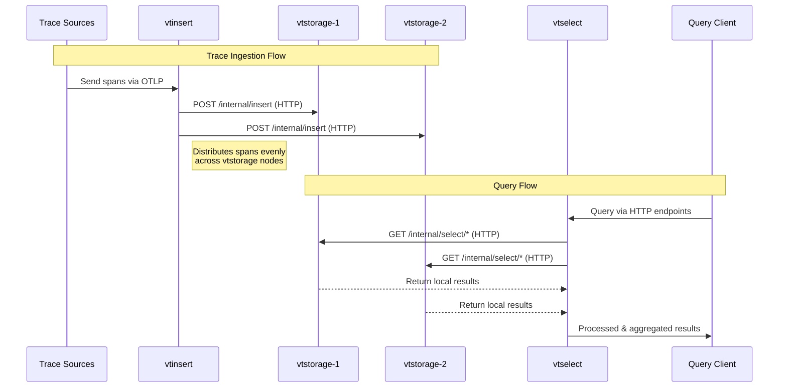
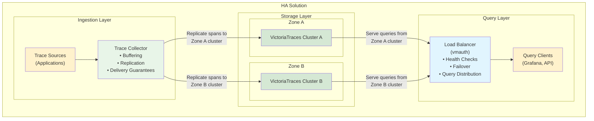

Cluster mode in VictoriaTraces provides horizontal scaling to many nodes when [single-node VictoriaTraces](https://docs.victoriametrics.com/victoriatraces/)
reaches vertical scalability limits of a single host. If you have an ability to run a single-node VictoriaTraces on a host with more CPU / RAM / storage space / storage IO,
then it is preferred to do this instead of switching to cluster mode, since a single-node VictoriaTraces instance has the following advantages over cluster mode:

- It is easier to configure, manage and troubleshoot, since it consists of a single self-contained component.
- It provides better performance and capacity on the same hardware, since it doesn't need
  to transfer data over the network between cluster components.

The migration path from a single-node VictoriaTraces to cluster mode is very easy - just add it to the list of `vtstorage` nodes
passed via `-storageNode` command-line flag to `vtinsert` and `vtselect` components of the cluster mode. See [cluster architecture](#architecture)
for more details about VictoriaTraces cluster components.

See [quick start guide](#quick-start) on how to start working with VictoriaTraces cluster.

## Architecture

VictoriaTraces in cluster mode is composed of three main components: `vtinsert`, `vtselect`, and `vtstorage`.



- `vtinsert` handles trace spans ingestion via [the OpenTelemetry protocol (OTLP)](https://opentelemetry.io/docs/specs/otlp/).
  It distributes incoming trace spans **by trace ID** evenly across `vtstorage` nodes, as specified by the `-storageNode` command-line flag.

- `vtselect` receives queries through [all supported HTTP query endpoints](https://docs.victoriametrics.com/victoriatraces/querying/).
  It fetches the required data from the configured `vtstorage` nodes, processes the queries, and returns the results.

- `vtstorage` performs two key roles:
  - It stores trace spans received from `vtinsert` at the directory defined by the `-storageDataPath` flag.
      See [storage configuration docs](https://docs.victoriametrics.com/victoriatraces/#storage) for details.
  - It handles queries from `vtselect` by retrieving and transforming the requested data locally before returning results.

Each `vtstorage` node operates as a self-contained VictoriaTraces instance.
Refer to the [single-node and cluster mode duality](#single-node-and-cluster-mode-duality) documentation for more information.
This design allows you to reuse existing single-node VictoriaTraces instances by listing them in the `-storageNode` flag for `vtselect`, enabling unified querying across all nodes.

All VictoriaTraces components are horizontally scalable and can be deployed on hardware best suited to their respective workloads.
`vtinsert` and `vtselect` can be run on the same node, which allows the minimal cluster to consist of just one `vtstorage` node and one node acting as both `vtinsert` and `vtselect`.
However, for production environments, it is recommended to separate `vtinsert` and `vtselect` roles to avoid resource contention — for example, to prevent heavy queries from interfering with trace ingestion.

Communication between `vtinsert` / `vtselect` and `vtstorage` is done via HTTP over the port specified by the `-httpListenAddr` flag:

- `vtinsert` sends data to the `/internal/insert` endpoint on `vtstorage`.
- `vtselect` sends queries to endpoints under `/internal/select/` on `vtstorage`.

This HTTP-based communication model allows you to use reverse proxies for authorization, routing, and encryption between components.
Use of [vmauth](https://docs.victoriametrics.com/victoriametrics/vmauth/) is recommended for managing access control.
See [Security docs](https://docs.victoriametrics.com/victoriatraces/#security) for details.

For advanced setups, refer to the [multi-level cluster setup](#multi-level-cluster-setup) documentation.

## High availability

In the cluster setup, the following rules apply:

- The `vtselect` component requires **all relevant vtstorage nodes to be available** in order to return complete and correct query results.

  - If even one of the vtstorage nodes is temporarily unavailable, `vtselect` cannot safely return a full response, since some of the required data may reside on the missing node. Rather than risk delivering partial or misleading query results, which can cause confusion, trigger false alerts, or produce incorrect metrics, VictoriaTraces chooses to return an error instead.

- The `vtinsert` component continues to function normally when some vtstorage nodes are unavailable. It automatically routes new trace spans to the remaining available nodes to ensure that data ingestion remains uninterrupted and newly received spans are not lost.

> [!NOTE] Insight
> In most real-world cases, `vtstorage` nodes become unavailable during planned maintenance such as upgrades, config changes, or rolling restarts. These are typically infrequent (weekly or monthly) and brief (a few minutes).
> A short period of query downtime during such events is acceptable and fits well within most SLAs. For example, 60 minutes of downtime per month still provides around 99.86% availability, which often outperforms complex HA setups that rely on opaque auto-recovery and may fail unpredictably.

VictoriaTraces itself does not handle replication at the storage level. Instead, it relies on an external trace shipper, such as [the OpenTelemetry collector](https://opentelemetry.io/docs/collector/), to send the same trace spans to multiple independent VictoriaTraces instances:



In this HA solution:

- A trace shipper at the top receives spans and replicates them in parallel to two VictoriaTraces clusters.
  - If one cluster fails completely (i.e., **all** of its storage nodes become unavailable), the trace shipper continues to send spans to the remaining healthy cluster and buffers any spans that cannot be delivered. When the failed cluster becomes available again, the trace shipper resumes sending both buffered and new spans to it.
- On the read path, a load balancer (e.g., [vmauth](https://docs.victoriametrics.com/victoriametrics/vmauth/)) sits in front of the VictoriaTraces clusters and routes query requests to any healthy cluster.
  - If one cluster fails (i.e., **at least one** of its storage nodes is unavailable), the load balancer detects this and automatically redirects all query traffic to the remaining healthy cluster.

There's no hidden coordination logic or consensus algorithm. You can scale it horizontally and operate it safely, even in bare-metal Kubernetes clusters using local PVs,
as long as the trace shipper handles reliable replication and buffering.

## Single-node and cluster mode duality

Every `vtstorage` node can be used as a single-node VictoriaTraces instance:

- It can accept spans via [the OpenTelemetry protocol (OTLP)](https://opentelemetry.io/docs/specs/otlp/).
- It can accept `select` queries via [all the supported HTTP querying endpoints](https://docs.victoriametrics.com/victoriatraces/querying/).

A single-node VictoriaTraces instance can be used as `vtstorage` node in VictoriaTraces cluster:

- It accepts data ingestion requests from `vtinsert` via `/internal/insert` HTTP endpoint at the TCP port specified via `-httpListenAddr` command-line flag.
- It accepts queries from `vtselect` via `/internal/select/*` HTTP endpoints at the TCP port specified via `-httpListenAddr` command-line flags.

See also [security docs](#security).

## Multi-level cluster setup

- `vtinsert` can send the ingested spans to other `vtinsert` nodes if they are specified via `-storageNode` command-line flag.
  This allows building multi-level data ingestion schemes when top-level `vtinsert` spreads the incoming spans evenly among multiple lower-level clusters of VictoriaTraces.

- `vtselect` can send queries to other `vtselect` nodes if they are specified via `-storageNode` command-line flag.
  This allows building multi-level cluster schemes when top-level `vtselect` queries multiple lower-level clusters of VictoriaTraces.

See [security docs](#security) on how to protect communications between multiple levels of `vtinsert` and `vtselect` nodes.

## Security

All the VictoriaTraces cluster components must run in protected internal network without direct access from the internet.
`vtstorage` must have no access from the internet. HTTP authorization proxies such as [vmauth](https://docs.victoriametrics.com/victoriametrics/vmauth/)
must be used in front of `vtinsert` and `vtselect` for authorizing access to these components from the internet.
See [Security docs](https://docs.victoriametrics.com/victoriatraces/#security).

It is possible to disallow access to `/internal/insert` and `/internal/select/*` endpoints at single-node VictoriaTraces instance
by running it with `-internalinsert.disable` and `-internalselect.disable` command-line flags.

### TLS

By default `vtinsert` and `vtselect` communicate with `vtstorage` via unencrypted HTTP. This is OK if all these components are located
in the same protected internal network. This isn't OK if these components communicate over the internet, since a third party can intercept / modify
the transferred data. It is recommended switching to HTTPS in this case:

- Specify `-tls`, `-tlsCertFile` and `-tlsKeyFile` command-line flags at `vtstorage`, so it accepts incoming requests over HTTPS instead of HTTP at the corresponding `-httpListenAddr`:

  ```sh
  ./victoria-traces-prod -httpListenAddr=... -storageDataPath=... -tls -tlsCertFile=/path/to/certfile -tlsKeyFile=/path/to/keyfile
  ```

- Specify `-storageNode.tls` command-line flag at `vtinsert` and `vtselect`, which communicate with the `vtstorage` over untrusted networks such as internet:

  ```sh
  ./victoria-traces-prod -storageNode=... -storageNode.tls
  ```

It is also recommended authorizing HTTPS requests to `vtstorage` via Basic Auth:

- Specify `-httpAuth.username` and `-httpAuth.password` command-line flags at `vtstorage`, so it verifies the Basic Auth username + password in HTTPS requests received via `-httpListenAddr`:

  ```sh
  ./victoria-traces-prod -httpListenAddr=... -storageDataPath=... -tls -tlsCertFile=... -tlsKeyFile=... -httpAuth.username=... -httpAuth.password=...
  ```

- Specify `-storageNode.username` and `-storageNode.password` command-line flags at `vtinsert` and `vtselect`, which communicate with the `vtstorage` over untrusted networks:

  ```sh
  ./victoria-traces-prod -storageNode=... -storageNode.tls -storageNode.username=... -storageNode.password=...
  ```

Another option is to use third-party HTTP proxies such as [vmauth](https://docs.victoriametrics.com/victoriametrics/vmauth/), `nginx`, etc. for authorizing and encrypting communications
between VictoriaTraces cluster components over untrusted networks.

By default, all the components (vtinsert, vtselect, vtstorage) support all the HTTP endpoints including `/insert/*` and `/select/*`.
It is recommended to disable select endpoints on `vtinsert` and insert endpoints on `vtselect`:

```sh
# Disable select endpoints on vtinsert
./victoria-traces-prod -storageNode=... -select.disable

# Disable insert endpoints on vtselect
./victoria-traces-prod -storageNode=... -insert.disable
```

This helps prevent sending select requests to `vtinsert` nodes or insert requests to `vtselect` nodes in case of misconfiguration in the authorization proxy
in front of the `vtinsert` and `vtselect` nodes.

See also [mTLS](#mtls).

### mTLS

[Enterprise version of VictoriaTraces](https://docs.victoriametrics.com/victoriametrics/enterprise/) will support the ability to verify client TLS certificates
at the `vtstorage` side for TLS connections established from `vtinsert` and `vtselect` nodes (aka [mTLS](https://en.wikipedia.org/wiki/Mutual_authentication#mTLS)).
See [TLS docs](#tls) for details on how to set up TLS communications between VictoriaTraces cluster nodes.

mTLS authentication can be enabled by passing the `-mtls` command-line flag to `vtstorage` node additionally to the `-tls` command-line flag.
In this case it verifies TLS client certificates for connections from `vtinsert` and `vtselect` at the address specified via `-httpListenAddr` command-line flag.

The client TLS certificate must be specified at `vtinsert` and `vtselect` nodes via `-storageNode.tlsCertFile` and `-storageNode.tlsKeyFile` command-line flags.

By default, the system-wide [root CA certificates](https://en.wikipedia.org/wiki/Root_certificate) are used for verifying client TLS certificates.
The `-mtlsCAFile` command-line flag can be used at `vtstorage` for pointing to custom root CA certificates.

## Quick start

The following guide covers the following topics for Linux host:

- How to download VictoriaTraces executable.
- How to start VictoriaTraces cluster, which consists of two `vtstorage` nodes, a single `vtinsert` node and a single `vtselect` node
  running on a localhost according to [cluster architecture](#architecture).
- How to ingest trace spans into the cluster.
- How to query the ingested traces.

Download and unpack the latest VictoriaTraces release:

```sh
curl -L -O https://github.com/VictoriaMetrics/VictoriaTraces/releases/download/v0.4.1/victoria-traces-linux-amd64-v0.4.1.tar.gz
tar xzf victoria-traces-linux-amd64-v0.4.1.tar.gz
```

Start the first [`vtstorage` node](#architecture), which accepts incoming requests at the port `10491` and stores the ingested spans at `victoria-traces-data-1` directory:

```sh
./victoria-traces-prod -httpListenAddr=:10491 -storageDataPath=victoria-traces-data-1 &
```

This command and all the following commands start cluster components as background processes.
Use `jobs`, `fg`, `bg` commands for manipulating the running background processes. Use `kill` command and/or `Ctrl+C` for stopping the running processes when they no longer needed.
See [these docs](https://tldp.org/LDP/abs/html/x9644.html) for details.

Start the second `vtstorage` node, which accepts incoming requests at the port `10492` and stores the ingested spans at `victoria-traces-data-2` directory:

```sh
./victoria-traces-prod -httpListenAddr=:10492 -storageDataPath=victoria-traces-data-2 &
```

Start `vtinsert` node, which [accepts spans](https://docs.victoriametrics.com/victoriatraces/data-ingestion/) at the port `10481` and spreads them evenly among the two `vtstorage` nodes started above:

```sh
./victoria-traces-prod -httpListenAddr=:10481 -storageNode=localhost:10491,localhost:10492 &
```

Start `vtselect` node, which [accepts incoming queries](https://docs.victoriametrics.com/victoriatraces/querying/) at the port `10471` and requests the needed data from `vtstorage` nodes started above:

```sh
./victoria-traces-prod -httpListenAddr=:10471 -storageNode=localhost:10491,localhost:10492 &
```

Note that all the VictoriaTraces cluster components - `vtstorage`, `vtinsert` and `vtselect` - share the same executable - `victoria-traces-prod`.
Their roles depend on whether the `-storageNode` command-line flag is set - if this flag is set, then the executable runs in `vtinsert` and `vtselect` modes.
Otherwise, it runs in `vtstorage` mode, which is identical to a [single-node VictoriaTraces mode](https://docs.victoriametrics.com/victoriatraces/).

Let's **ingest some trace spans** into the VictoriaTraces cluster.

If you don't have instrumented application, one simple way is to use [vtgen](https://github.com/VictoriaMetrics/VictoriaTraces/tree/master/app/vtgen), a trace data generator.
It needs to be built from source with Go or docker:

```shell
# clone the source code
git clone https://github.com/VictoriaMetrics/VictoriaTraces.git
cd VictoriaTraces

# build via go build
make vtgen
# build via Docker
make vtgen-prod
```

To generate and send data to VictoriaTraces cluster(`vtinsert`), run:

```shell
./bin/vtgen -addrs=http://localhost:10481/insert/opentelemetry/v1/traces
```

Let's **query the ingested traces** via `/select/logsql/query` HTTP endpoint.
For example, the following command returns the number of stored spans in the cluster:

```sh
curl http://localhost:10471/select/logsql/query -d 'query=* | count()'
```

Trace spans also can be explored and queried via [built-in Web UI](https://docs.victoriametrics.com/victoriatraces/querying/#web-ui).
Open `http://localhost:10471/select/vmui/` in the web browser, select `last 7 days` time range in the top right corner and explore the ingested trace spans.
See [LogsQL docs](https://docs.victoriametrics.com/victorialogs/logsql/) to familiarize yourself with the query language.

Every `vtstorage` node can be queried individually because [it is equivalent to a single-node VictoriaTraces](#single-node-and-cluster-mode-duality).
For example, the following command returns the number of stored spans at the first `vtstorage` node started above:

```sh
curl http://localhost:10491/select/logsql/query -d 'query=* | count()'
```

It is recommended reading [key concepts](https://docs.victoriametrics.com/victoriatraces/keyconcepts/) before you start working with VictoriaTraces.

See also [security docs](#security).

## Performance tuning

Cluster components of VictoriaTraces automatically adjust their settings for the best performance and the lowest resource usage on the given hardware.
So there is no need in any tuning of these components in general. The following options can be used for achieving higher performance / lower resource
usage on systems with constrained resources:

- `vtinsert` limits the number of concurrent requests to every `vtstorage` node. The default concurrency works great in most cases.
  Sometimes it can be increased via `-insert.concurrency` command-line flag at `vtinsert` in order to achieve higher data ingestion rate
  at the cost of higher RAM usage at `vtinsert` and `vtstorage` nodes.

- `vtinsert` compresses the data sent to `vtstorage` nodes in order to reduce network bandwidth usage at the cost of slightly higher CPU usage
  at `vtinsert` ant `vtstorage` nodes. The compression can be disabled by passing `-insert.disableCompression` command-line flag to `vtinsert`.
  This reduces CPU usage at `vtinsert` and `vtstorage` nodes at the cost of significantly higher network bandwidth usage.

- `vtselect` requests compressed data from `vtstorage` nodes in order to reduce network bandwidth usage at the cost of slightly higher CPU usage
  at `vtselect` and `vtstorage` nodes. The compression can be disabled by passing `-select.disableCompression` command-line flag to `vtselect`.
  This reduces CPU usage at `vtselect` and `vtstorage` nodes at the cost of significantly higher network bandwidth usage.

## Advanced usage

Cluster components of VictoriaTraces provide various settings, which can be configured via command-line flags if needed.
Default values for all the command-line flags work great in most cases, so it isn't recommended
tuning them without the real need. See [the list of supported command-line flags at VictoriaTraces](https://docs.victoriametrics.com/victoriatraces/#list-of-command-line-flags).
